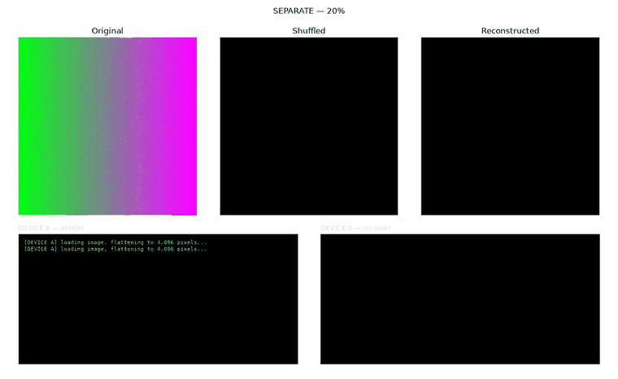
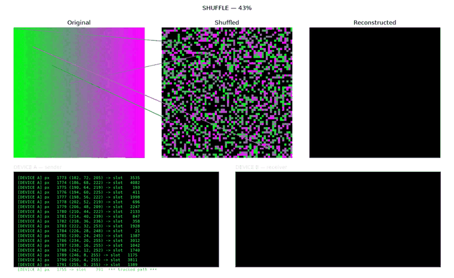
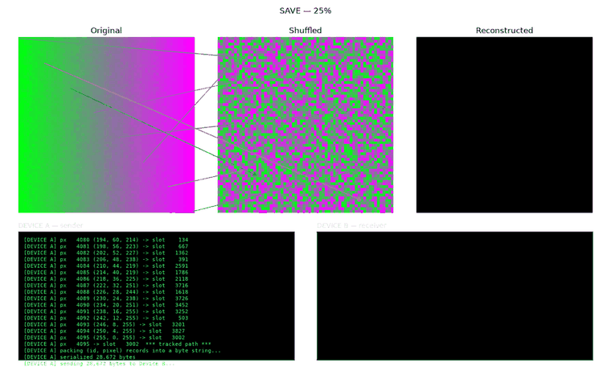
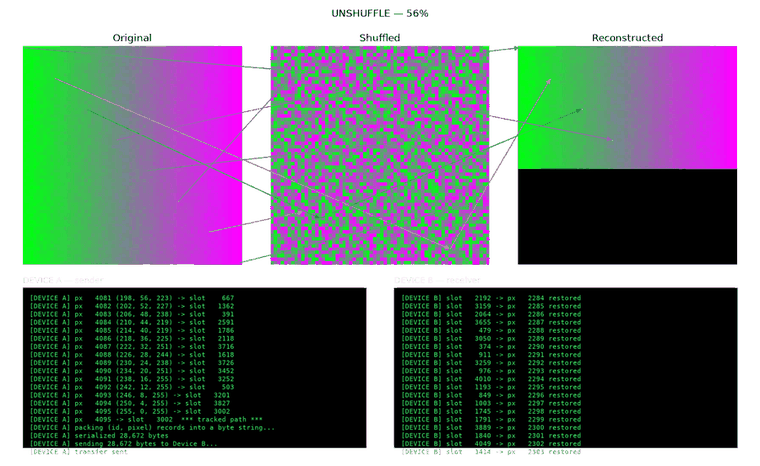
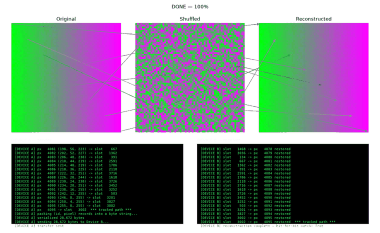

# Pixel Permutation Lab

A from-scratch, keyed, reversible pixel-shuffle transform for images — built to understand permutation ciphers hands-on, and stress-tested against an image carrying real code-injection payloads in its metadata.

| Original | Shuffled | Reconstructed |
|---|---|---|
|  |  |  |

615,300 pixels ([`docs/sample.png`](docs/sample.png), a resized PNG test image), shuffled and unshuffled through the real `theory.py` pipeline (flatten → permute → serialize to bytes → parse → reverse). Reconstructed is a bit-for-bit match of Original.

## What this is

At its core, this repo does one thing: take an image, scatter every pixel to a new position using a seeded pseudorandom permutation, serialize the result to bytes, and reverse the whole process losslessly. No pixel *value* ever changes — only pixel *position* — which makes this a **transposition cipher**, the classical sibling of substitution ciphers like AES's S-box. It doesn't hide *what* colors are in an image, only *where* they are, and that limitation is deliberate — see [How it works](#how-it-works). The Shuffled panel above looks like pure static, but its color histogram is pixel-for-pixel identical to the Original's — nothing about *value* was ever touched, only position.

Four things live here:

| File | What it does |
|---|---|
| [`theory.py`](theory.py) | The core algorithm: load an image, shuffle its pixels with a seeded permutation, serialize to a flat byte file, then reverse it and confirm a bit-for-bit match. No visualization — just the mechanism. |
| [`make_before_after.py`](make_before_after.py) | Runs the real `theory.py` pipeline on any image and saves original/shuffled/reconstructed stills — this is what generated the table above. |
| [`pixel_demo.py`](pixel_demo.py) | An animated, two-device simulation of the same pipeline on a small image, with a live console log on each side and drawn paths tracking individual pixels — see [Code-injection test](#code-injection-test) below, where it's used. |
| [`make_injection_test_png.py`](make_injection_test_png.py) + [`check_injection_canaries.py`](check_injection_canaries.py) | A safety-testing pair: generates a PNG with ~45 categories of real code-injection payloads embedded in its metadata, each wired to a harmless local canary file, then verifies after any pipeline run that nothing actually fired. |

## How it works

1. **Flatten.** The image becomes a flat array of pixels — `(pixel_count, channels)` — in row-major order.
2. **Generate a permutation.** `numpy.random.default_rng(seed).permutation(pixel_count)` produces a deterministic bijection: the same seed always produces the same permutation. The seed is the entire secret here — it's the "key."
3. **Scatter.** `shuffled[permutation] = flat_pixels` — pixel `i` moves to slot `permutation[i]`. This is a *write*-indexed scatter, not a read.
4. **Serialize.** Each shuffled pixel is packed into a structured record — a 4-byte position `id` plus its color channels — and the whole array is written out as a flat byte string.
5. **Reverse.** To undo it: parse the byte string back into records, then **gather** — `shuffled[permutation]` — using the *same* permutation as a *read*-indexed lookup. This is the exact inverse of step 3, not a separate algorithm.

The scatter/gather distinction in steps 3 and 5 is the easiest part of this to get backwards — using the same indexing direction for both steps silently produces a *different*, wrong permutation instead of an inverse, and the result can still look like a plausible (but wrong) image rather than crashing outright.

### Why this isn't real encryption

A permutation alone provides **diffusion** (it scrambles position) but no **confusion** (it never touches the actual values). Run a histogram of pixel colors before and after shuffling — it's identical, no matter how convincingly like noise the shuffled image looks. This is exactly the weakness that broke classical transposition ciphers historically (anagramming and frequency analysis recover the plaintext once you have enough ciphertext), and it's exactly why real block ciphers like AES pair a permutation step (`ShiftRows`) with a substitution step (`SubBytes`) rather than relying on either alone. This repo isolates the permutation half on purpose, as a way to see that half clearly — it is not a substitute for actual encryption of image data.

## Quickstart

```sh
pip install -r requirements.txt

# run the core shuffle/unshuffle round trip (no UI)
python theory.py

# regenerate the original/shuffled/reconstructed stills above, on any image
python make_before_after.py path/to/image.png
```

## Code-injection test

`make_injection_test_png.py` builds a separate test image — `injection_test.png` — whose *pixel data* is ordinary (a gradient + noise pattern) but whose *metadata* (PNG `tEXt`/`zTXt`/`iTXt` chunks, plus one hand-built raw ancillary chunk for code that parses chunks manually) carries around 45 categories of real injection payloads: command injection, SQL/NoSQL/LDAP/XPath injection, template injection, XSS, log/header injection, path traversal, unsafe deserialization, format strings, ReDoS, CSV formula injection, SSRF, and Unicode tricks.

None of this pipeline ever reads that metadata into an `eval`, `exec`, shell, or deserializer — `theory.py` and `pixel_demo.py` only ever touch pixel data. The point is to confirm that claim empirically rather than just assert it: every payload that *could* actually execute something if a future code path were careless is wired to a harmless local canary (touching one marker file under `/tmp/injection_canary`), so `check_injection_canaries.py` can verify after any run that nothing fired. Every dangerous-looking payload in this repo is intentionally inert by construction — see the file for the specific safety guarantees on each category (e.g. the log4shell-style JNDI canary only ever points at a closed local port, never a real host).

```sh
# generate the test image with embedded injection-canary metadata
python make_injection_test_png.py

# confirm nothing in the pipeline executed any embedded payload
python check_injection_canaries.py
```

### Watching it happen, pixel by pixel

`pixel_demo.py` runs the same shuffle/serialize/reverse pipeline as an animation, on `injection_test.png` specifically — small (64×64) on purpose, since the pipeline is O(pixel count) and a small image keeps every individual pixel move visible and legible in the animation and console log, rather than a blur of thousands of lines per second. Device A shuffles and "sends" the byte string with a live console log; Device B "receives" and reconstructs it pixel by pixel in the `Reconstructed` panel; a handful of tracked pixels get a drawn path across all three panels.


| Start | Mid-shuffle | Sent |
|---|---|---|
|  |  |  |

| Reconstructing | Done — bit-for-bit match |
|---|---|
|  |  |

```sh
python pixel_demo.py                        # opens an interactive window (space to pause/resume)
python pixel_demo.py --save docs/demo.gif   # headless, writes a GIF instead
python pixel_demo.py --fps 60               # playback speed
python pixel_demo.py --track-count 0        # disable the drawn pixel paths
python pixel_demo.py --full-string          # print every byte of the transfer string, not just a preview
python pixel_demo.py some_other_image.png   # run it on any image instead of the default
```

## Background

This started as a prototype for a planned feature in a separate embedded-systems project (a point-to-point encrypted messaging device pair) that wants to move images between two devices without either device ever opening or storing a real image file itself — only ever passing this shuffled representation as a string, with real images only ever materializing on external storage. This repo is the standalone version of that idea: the algorithm and the demo, without any of that project's specific integration.

## Honest limitations

- The seed is hardcoded (`SEED = 1234`) — this is a demonstration of the mechanism, not a keyed scheme. There's no key management, no per-message uniqueness, and reusing a fixed seed across many images is the same class of mistake as IV/nonce reuse in a real cipher.
- This provides no confidentiality on its own (see [Why this isn't real encryption](#why-this-isnt-real-encryption)). It should never be presented as encryption, no matter how convincing the shuffled image looks.
- The injection-canary testing is not a formal security audit and doesn't claim to cover every possible payload category — it's a concrete, runnable check against a defined, documented set of categories, not an exhaustive one.

## Repository layout

```
theory.py                    core shuffle/unshuffle algorithm, no UI
make_before_after.py         runs theory.py on any image, saves before/after stills
pixel_demo.py                animated two-device visualization
make_injection_test_png.py   generates the code-injection canary test image
check_injection_canaries.py  verifies no embedded payload executed
docs/                        README assets (sample image, stills, demo GIF)
```

## License

[MIT](LICENSE)
